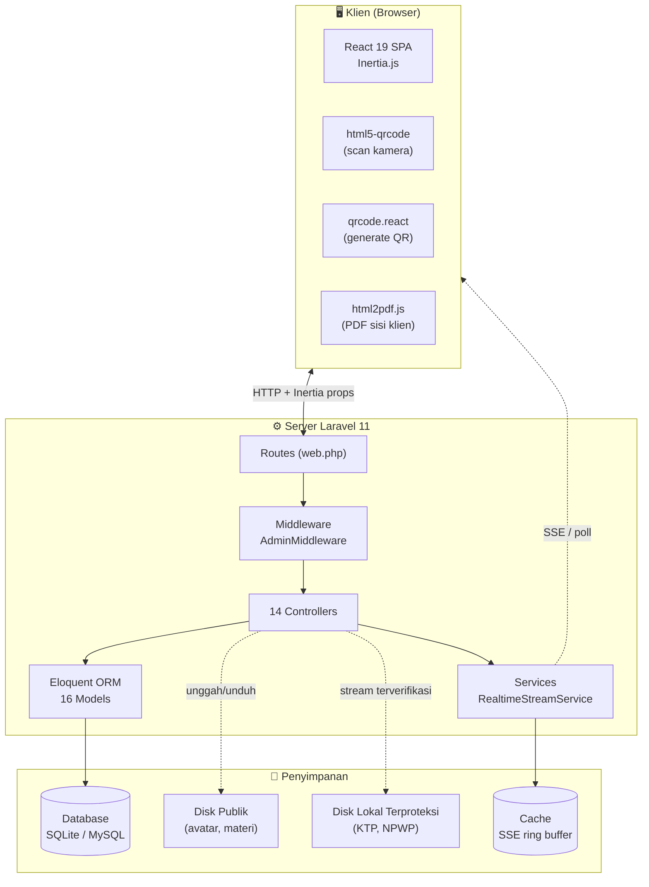
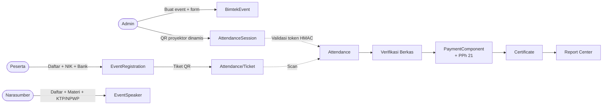
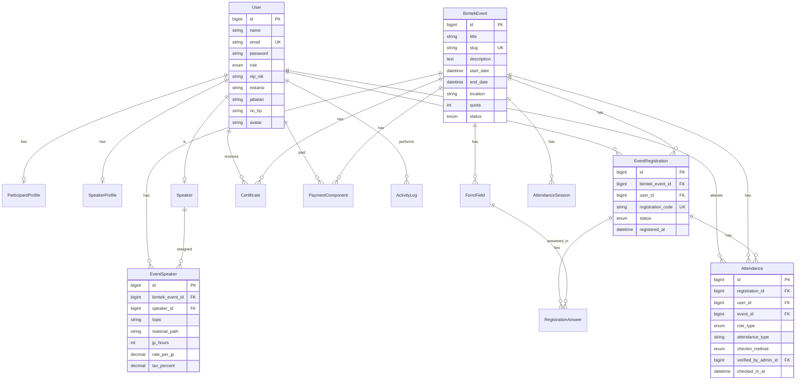

# PRD — SIM-BIMTEK Diskominfo Kabupaten Bogor

> **Product Requirements Document** untuk Sistem Informasi Manajemen Bimbingan Teknis (SIM-BIMTEK) Dinas Komunikasi dan Informatika Kabupaten Bogor.
>
| Atribut | Nilai |
|---|---|
| **Versi dokumen** | 1.0 |
| **Tanggal** | September 2026 |
| **Status** | Aktif / Demo |
| **Pemilik produk** | Bidang Aplikasi Informatika (APTIKA) — Diskominfo Kab. Bogor |
| **Stack** | Laravel 11 · Inertia.js · React 19 · Tailwind CSS · SQLite/MySQL |

---

## Daftar Isi

1. [Ringkasan Eksekutif](#1-ringkasan-eksekutif)
2. [Latar Belakang & Tujuan](#2-latar-belakang--tujuan)
3. [Peran Pengguna & Hak Akses](#3-peran-pengguna--hak-akses)
4. [Arsitektur Sistem](#4-arsitektur-sistem)
5. [Struktur Kode & Direktori](#5-struktur-kode--direktori)
6. [Struktur Data (ERD)](#6-struktur-data-erd)
7. [Modul Fungsional](#7-modul-fungsional)
8. [Alur Kerja Utama](#8-alur-kerja-utama)
9. [Fitur Andalan](#9-fitur-andalan)
10. [Keamanan & Audit](#10-keamanan--audit)
11. [Status & Akses Demo](#11-status--akses-demo)
12. [Pengembangan & Catatan](#12-pengembangan--catatan)

---

## 1. Ringkasan Eksekutif

**SIM-BIMTEK** adalah Sistem Informasi Manajemen Bimbingan Teknis yang dibangun untuk Dinas Komunikasi dan Informatika (Diskominfo) Kabupaten Bogor. Sistem ini mengelola **siklus hidup penuh** sebuah kegiatan bimbingan teknis kedinasan — dari katalog & pendaftaran event, registrasi peserta dan narasumber, presensi hari-H berbasis QR dinamis, verifikasi berkas identitas, perhitungan honorarium dengan pemotongan PPh 21 otomatis, hingga penerbitan dan pengarsipan sertifikat.

Dibangun di atas **Laravel 11 + Inertia.js + React**, sistem memisahkan tiga peran pengguna — **Administrator**, **Peserta** (ASN/Umum), dan **Narasumber/Pakar** — dengan dashboard, navigasi, dan alur kerja yang berbeda untuk masing-masing. Seluruh antarmuka berbahasa Indonesia dan mengikuti konvensi dokumen kedinasan (kop surat, berita acara, format pemerintahan).

### Nilai bisnis

Satu portal terpadu untuk seluruh siklus bimtek:

```
KATALOG → DAFTAR → TIKET QR → PRESENSI HARI-H → VERIFIKASI BERKAS → HONORARIUM + PAJAK → SERTIFIKAT → LAPORAN
```

Tidak lagi tersebar di spreadsheet dan dokumen manual — akurat, auditable, dan efisien di lapangan.

---

## 2. Latar Belakang & Tujuan

Kegiatan bimbingan teknis (bimtek) merupakan instrumen peningkatan kapasitas SDM aparatur Pemerintah Kabupaten Bogor. Sebelumnya, pengelolaan bimtek — pendaftaran, presensi, honorarium narasumber beserta pajak penghasilan, hingga sertifikat — tersebar di berkas manual dan lembar kerja terpisah, rawan kesalahan dan sulit diaudit.

### Tujuan

| Tujuan | Cara pencapaian |
|---|---|
| **Transparan & auditable** | Log aktivitas tak terhapus (`ActivityLog`) dan alur verifikasi berkas identitas. |
| **Akurat perpajakan** | Perhitungan PPh 21 otomatis berbasis golongan ASN (IV = 15%, III = 5%, Non-ASN = 2,5%). |
| **Efisien di lapangan** | Presensi hari-H dengan QR dinamis anti-fraud dan pemindai kamera HP. |
| **Standar dokumen** | Kop surat, berita acara, dan ekspor format pemerintahan yang dapat disesuaikan. |

---

## 3. Peran Pengguna & Hak Akses

Sistem mengenali tiga peran dengan dashboard dan hak akses yang berbeda. Login mendukung email maupun NIP/NIK (dengan normalisasi pemisah). Kontrol akses dijalankan oleh `AdminMiddleware` yang memeriksa `role === 'admin'`.

### Matriks hak akses

| Kemampuan | Admin | Peserta | Narasumber |
|---|:---:|:---:|:---:|
| Katalog & detail event | Penuh | Lihat | Lihat |
| CRUD event & form builder | Ya | — | — |
| Pendaftaran event | Kelola | NIK + Bank + Dinamis | Materi + KTP + NPWP + PPh |
| Presensi QR | Generator + Manual | Scan / 1-klik | Scan / 1-klik |
| Tiket digital & QR | Lihat semua | Tiket sendiri | — |
| Materi presentasi | Kelola | Unduh | Unggah/Hapus |
| Sertifikat | Bulk + Auto-match | Unduh sendiri | Unduh sendiri |
| Honorarium & PPh 21 | Hitung + Status | — | Lihat profil |
| Verifikasi identitas | Setujui/Tolak | Lihat KTP/NPWP sendiri | Lihat KTP/NPWP sendiri |
| Laporan & ekspor | Ekspor CSV | Riwayat | Laporan sendiri |
| Real-time monitoring (SSE) | Stream + Poll | — | — |

### Detail peran

- 🔵 **Administrator** (`admin`) — Operator Diskominfo. Kelola event, generate QR proyektor, verifikasi berkas, hitung honor & PPh, repository sertifikat, laporan, monitoring real-time.
- 🟢 **Peserta** (`user` / `peserta`) — ASN atau umum. Daftar bimtek (NIK + rekening bank BJB + field dinamis), dapat tiket QR, presensi scan, unduh sertifikat.
- 🟡 **Narasumber** (`pembicara`) — Pakar/widyaiswara. Jadwal mengajar, upload materi presentasi, rekening bank + data PPh, presensi sesi, sertifikat narasumber.

---

## 4. Arsitektur Sistem

### 4.1 Arsitektur tingkat tinggi

Arsitektur monolitik modern: satu aplikasi Laravel sebagai sumber tunggal kebenaran, dengan React dirender lewat Inertia.js sebagai SPA — **tanpa API terpisah**. Inertia mengirimkan data sebagai props ke komponen React, menggabungkan kekuatan routing server-side dengan UX SPA.



### 4.2 Stack teknologi

| Lapisan | Teknologi | Keterangan |
|---|---|---|
| **Backend** | Laravel 11 (PHP 8.2) | Framework utama, Eloquent ORM, antrian & cache berbasis database, otentikasi sesi |
| **Database** | SQLite (default) atau MySQL/MariaDB | Via PDO; file `database/database.sqlite` |
| **Frontend** | React 19 via Inertia.js | SPA tanpa API terpisah |
| **Styling** | Tailwind CSS 3.4 | Palet warna kedaerahan Bogor (navy, gold, green) |
| **Build tool** | Vite 5 | Hot module replacement & build produksi |
| **Pustaka QR** | `html5-qrcode` + `qrcode.react` | Pemindai kamera & generator QR |
| **PDF** | `html2pdf.js` | Generasi PDF sisi klien untuk laporan |
| **Ikon** | `lucide-react` | Set ikon |
| **Real-time** | Server-Sent Events (SSE) | Via `RealtimeStreamService`, bukan WebSocket |
| **Deployment** | Docker / `php artisan serve` | Multi-worker untuk akses HP via LAN |

### 4.3 Keputusan desain arsitektur

**SSE + ring buffer cache** dipilih ketimbang WebSocket agar ringan dan cocok dengan server PHP single-threaded. Stream ditutup segera setelah flush untuk mencegah kelaparan thread. Polling cepat tersedia sebagai fallback.

**Disk terproteksi** untuk berkas sensitif (KTP, NPWP) disimpan di `storage/app/local/documents/` (di luar webroot publik), diakses hanya lewat `DocumentStreamController` yang memverifikasi kepemilikan — bukan URL langsung.

**Inertia.js** alih-alih API REST terpisah — mengurangi duplikasi logika antara server dan klien, dan mempertahankan otentikasi sesi Laravel secara native.

### 4.4 Diagram alur data



---

## 5. Struktur Kode & Direktori

```
bimtek-diskominfo-bogor/
├── app/
│   ├── Events/
│   │   └── ParticipantRegistered.php
│   ├── Http/
│   │   ├── Controllers/          # 14 controller logika bisnis
│   │   │   ├── AttendanceController.php
│   │   │   ├── AuthController.php
│   │   │   ├── BimtekEventController.php
│   │   │   ├── CertificateController.php
│   │   │   ├── Controller.php
│   │   │   ├── DocumentStreamController.php
│   │   │   ├── FormBuilderController.php
│   │   │   ├── PaymentController.php
│   │   │   ├── ProfileController.php
│   │   │   ├── RealtimeController.php
│   │   │   ├── RegistrationController.php
│   │   │   ├── ReportCenterController.php
│   │   │   ├── SpeakerController.php
│   │   │   └── VerificationController.php
│   │   └── Middleware/
│   │       ├── AdminMiddleware.php
│   │       └── HandleInertiaRequests.php
│   ├── Models/                    # 16 model Eloquent
│   │   ├── ActivityLog.php
│   │   ├── Attendance.php
│   │   ├── AttendanceSession.php
│   │   ├── BimtekEvent.php
│   │   ├── Certificate.php
│   │   ├── DocumentTemplate.php
│   │   ├── EventRegistration.php
│   │   ├── EventSpeaker.php
│   │   ├── FormField.php
│   │   ├── ParticipantProfile.php
│   │   ├── PaymentComponent.php
│   │   ├── RegistrationAnswer.php
│   │   ├── Speaker.php
│   │   ├── SpeakerProfile.php
│   │   ├── TaxParameter.php
│   │   ├── User.php
│   │   └── SpeakerProfile.php
│   ├── Providers/
│   │   └── AppServiceProvider.php
│   └── Services/
│       └── RealtimeStreamService.php
├── database/
│   ├── migrations/                # 18 file migrasi
│   ├── factories/
│   └── seeders/
│       ├── DatabaseSeeder.php
│       ├── SampleParticipantsSeeder.php
│       └── DeleteSampleParticipantsSeeder.php
├── resources/js/
│   ├── app.jsx                    # Bootstrap Inertia
│   ├── Components/                # Komponen reusable
│   ├── Hooks/                     # useParticipantRealtime.js
│   ├── Layouts/                   # AppLayout.jsx
│   └── Pages/                     # Halaman Inertia React
│       ├── Auth/
│       ├── Events/
│       ├── Attendance/
│       ├── Certificates/
│       ├── Profile/
│       └── Admin/
├── routes/
│   ├── web.php                    # Peta rute lengkap
│   └── console.php
├── public/
├── storage/                       # Disk publik + lokal terproteksi
├── tests/
├── Dockerfile
├── jalankan-aplikasi.bat          # 1-klik Windows
└── package.json
```

---

## 6. Struktur Data (ERD)

Enam belas model Eloquent. Inti tata kelola berputar di sekitar `User`, `BimtekEvent`, `EventRegistration`, dan `EventSpeaker`.

### 6.1 Diagram entitas-relasi



### 6.2 Daftar entitas

| Entitas (Model) | Tabel | Peran | Relasi utama |
|---|---|---|---|
| **User** | `users` | Akun pengguna 3 peran | 1:1 ParticipantProfile/SpeakerProfile/Speaker; 1:N EventRegistration/Attendance/Certificate/PaymentComponent/ActivityLog |
| **BimtekEvent** | `bimtek_events` | Kegiatan bimtek | 1:N FormField/EventRegistration/EventSpeaker/Attendance/AttendanceSession/Certificate/PaymentComponent. Status: draft/open/ongoing/completed |
| **EventRegistration** | `event_registrations` | Pendaftaran peserta | N:1 BimtekEvent & User; 1:N RegistrationAnswer & Attendance. Kode unik `BMK-YYYY-XXXXXX` |
| **EventSpeaker** | `event_speakers` | Penugasan narasumber | N:1 BimtekEvent & Speaker. Topik, JP jam, tarif per JP, tarif pajak, materi. Aksesor: hitung bruto/pajak/neto |
| **Speaker** | `speakers` | Data master narasumber | N:1 User; 1:N EventSpeaker. Golongan, rekening bank |
| **FormField** | `form_fields` | Field form dinamis | N:1 BimtekEvent; 1:N RegistrationAnswer. Tipe: text/number/select/radio/checkbox/file/date |
| **RegistrationAnswer** | `registration_answers` | Jawaban field dinamis | N:1 EventRegistration & FormField |
| **ParticipantProfile** | `participant_profiles` | Profil identitas peserta | 1:1 User. NIK, NPWP, rekening bank, status verifikasi |
| **SpeakerProfile** | `speaker_profiles` | Profil identitas narasumber | 1:1 User. NIK, NPWP, rekening, salinan buku rekening, bahan materi, golongan |
| **Attendance** | `attendances` | Log presensi | N:1 EventRegistration/User/BimtekEvent; N:1 User (verified_by_admin). Metode: qr_scan/manual_admin/self_verify |
| **AttendanceSession** | `attendance_sessions` | Sesi QR dinamis | N:1 BimtekEvent. Token, secret_key, interval rotasi, valid_from/until |
| **PaymentComponent** | `payment_components` | Komponen pembayaran | N:1 BimtekEvent & User. honorarium/uang_jalan/transport, bruto-pajak-neto. Status: pending/verified/processed/paid |
| **TaxParameter** | `tax_parameters` | Lookup tarif PPh 21 | Mandiri. Kategori golongan + tarif % |
| **Certificate** | `certificates` | Sertifikat | N:1 BimtekEvent & User. Nomor unik + file |
| **DocumentTemplate** | `document_templates` | Template dokumen resmi | Mandiri. HTML body, kop surat, pejabat penanda tangan |
| **ActivityLog** | `activity_logs` | Log audit tak terhapus | N:1 User. Aksi, modul, IP, user agent |

### 6.3 Enum & status penting

- **User.role**: `admin`, `user` (peserta), `pembicara`
- **BimtekEvent.status**: `draft`, `open`, `ongoing`, `completed`
- **EventRegistration.status**: `pending`, `approved`, `rejected`
- **Attendance.checkin_method**: `qr_scan`, `manual_admin`, `self_verify`
- **Attendance.role_type**: `peserta`, `pembicara`
- **PaymentComponent.payment_status**: `pending`, `verified`, `processed`, `paid`
- **PaymentComponent.component_type**: `honorarium`, `uang_jalan`, `transport`
- **verification_status** (profil): `belum_diverifikasi`, `terverifikasi`, `perlu_perbaikan`
- **FormField.field_type**: `text`, `number`, `select`, `radio`, `checkbox`, `file`, `date`

---

## 7. Modul Fungsional

Sebelas modul fungsional menyusun sistem. Setiap modul dipetakan ke controller dan rute utamanya.

### Modul 1 — Landing & Katalog Event

Portal publik memajang bimtek terbaru (6 event terakhir dengan jumlah pendaftar), katalog lengkap dengan filter, dan detail event berisi rundown, narasumber, serta unduhan materi.

| Method | Rute | Controller | Deskripsi |
|---|---|---|---|
| GET | `/` | `BimtekEventController@publicLanding` | Landing publik |
| GET | `/events` | `BimtekEventController@index` | Katalog event |
| GET | `/events/{id}` | `BimtekEventController@show` | Detail event |

### Modul 2 — Otentikasi & Pendaftaran Akun

Login fleksibel via email atau NIP/NIK (dengan normalisasi regex). Alur pendaftaran terpisah untuk Peserta dan Narasumber — termasuk email narasumber otomatis berdomain `@narasumber.bogorkab.go.id`. Tombol Quick Switch (khusus admin) untuk berpindah peran saat pengujian.

| Method | Rute | Controller | Deskripsi |
|---|---|---|---|
| GET/POST | `/login` | `AuthController@showLogin/login` | Login email/NIP |
| GET/POST | `/register/peserta` | `AuthController` | Daftar peserta |
| GET/POST | `/register/pembicara` | `AuthController` | Daftar narasumber |
| GET | `/quick-switch/{role}` | `AuthController@quickSwitch` | Ganti peran (admin) |
| GET/POST | `/logout` | `AuthController@logout` | Logout |

### Modul 3 — Dashboard Terisolasi per Peran

Admin melihat statistik agregat (total event, peserta, pendaftaran, presensi hari ini, honor) + metrik real-time. Peserta melihat pendaftaran & tiket. Narasumber melihat jadwal mengajar.

| Method | Rute | Controller | Deskripsi |
|---|---|---|---|
| GET | `/dashboard` | Closure (Inertia render) | Dashboard per peran |

### Modul 4 — CRUD Event & Form Builder Dinamis

Admin membuat/mengedit/menghapus event bimtek dengan slug otomatis. Form Builder memungkinkan field kustom per event (text, number, select, radio, checkbox, file, date) dengan urutan yang dapat diseret.

| Method | Rute | Controller | Deskripsi |
|---|---|---|---|
| POST | `/admin/events/store` | `BimtekEventController@store` | Buat event |
| PUT | `/admin/events/{id}` | `BimtekEventController@update` | Edit event |
| DELETE | `/admin/events/{id}` | `BimtekEventController@destroy` | Hapus event |
| GET | `/admin/events/{eventId}/form-builder` | `FormBuilderController@edit` | Desainer form |
| POST | `/admin/events/{eventId}/form-fields` | `FormBuilderController@store` | Tambah field |
| PUT | `/admin/form-fields/{id}` | `FormBuilderController@update` | Edit field |
| POST | `/admin/events/{eventId}/reorder-fields` | `FormBuilderController@reorder` | Urut ulang |
| DELETE | `/admin/form-fields/{id}` | `FormBuilderController@destroy` | Hapus field |

### Modul 5 — Pendaftaran Event Terisolasi per Peran

Peserta mengisi NIK, rekening bank (BJB), dan menjawab field dinamis + unggah surat tugas; menghasilkan kode unik `BMK-YYYY-XXXXXX`. Narasumber mengunggah KTP, NPWP, salinan rekening, dan bahan materi; pajak PPh dihitung per golongan.

| Method | Rute | Controller | Deskripsi |
|---|---|---|---|
| GET | `/events/{eventId}/register` | `RegistrationController@showRegistrationForm` | Form pendaftaran |
| POST | `/events/{eventId}/register` | `RegistrationController@store` | Simpan pendaftaran |
| GET | `/registrations/{id}/ticket` | `RegistrationController@ticket` | Tiket digital |

### Modul 6 — Presensi QR Dinamis Hari-H

Admin menampilkan QR proyektor yang berotasi (token HMAC-SHA256, default 10 menit). Peserta/narasumber memindai dengan kamera HP (`html5-qrcode`) atau verifikasi 1-klik. Gatekeeper memeriksa kelengkapan profil sebelum absen. Admin dapat check-in manual sebagai cadangan.

| Method | Rute | Controller | Deskripsi |
|---|---|---|---|
| GET | `/attendance/scan` | `AttendanceController@scanView` | Halaman pemindai |
| POST | `/attendance/check-in` | `AttendanceController@checkIn` | Proses absen |
| GET | `/admin/events/{id}/qr-event` | `AttendanceController@adminEventQr` | QR proyektor |
| POST | `/admin/events/{id}/qr-session` | `AttendanceController@generateNewQrSession` | Rotasi token |
| POST | `/admin/attendance/manual` | `AttendanceController@adminManualCheckIn` | Absen manual |

### Modul 7 — Verifikasi Berkas Identitas

Antrean verifikasi admin untuk profil peserta & narasumber: KTP, NPWP, dan rekening bank. Status berpindah antara `belum_diverifikasi` → `terverifikasi` / `perlu_perbaikan`, dengan catatan dan log audit tak terhapus.

| Method | Rute | Controller | Deskripsi |
|---|---|---|---|
| GET | `/admin/verifications` | `VerificationController@index` | Antrean verifikasi |
| POST | `/admin/verifications/{id}/status` | `VerificationController@updateStatus` | Update status |

### Modul 8 — Honorarium & PPh 21

Perhitungan bruto, pemotongan pajak, dan neto untuk honorarium, uang jalan narasumber, dan transport peserta. Detail bank otomatis diambil dari profil penerima. Parameter tarif pajak dapat dikonfigurasi per kategori. Status pembayaran: `pending → verified → processed → paid`.

| Method | Rute | Controller | Deskripsi |
|---|---|---|---|
| GET | `/admin/payments` | `PaymentController@index` | Daftar pembayaran |
| POST | `/admin/payments/store` | `PaymentController@store` | Hitung + simpan |
| POST | `/admin/payments/{id}/status` | `PaymentController@updateStatus` | Update status bayar |
| DELETE | `/admin/payments/{id}` | `PaymentController@destroy` | Hapus |
| GET | `/admin/tax-settings` | `PaymentController@taxSettings` | Pengaturan PPh |
| POST | `/admin/tax-settings/store` | `PaymentController@storeTaxParameter` | Tambah tarif |
| PUT | `/admin/tax-settings/{id}` | `PaymentController@updateTaxParameter` | Edit tarif |

### Modul 9 — Repository Sertifikat

Manajemen sertifikat gaya Google Drive per event. Unggah massal arsip ZIP atau banyak file PDF/gambar, dengan pencocokan otomatis ke penerima berdasarkan NIK, kode registrasi, atau nama. Unduh semua sertifikat satu event sebagai ZIP. Peserta/narasumber mengunduh sertifikat mereka sendiri.

| Method | Rute | Controller | Deskripsi |
|---|---|---|---|
| GET | `/admin/certificates` | `CertificateController@index` | Repository |
| POST | `/admin/certificates/store` | `CertificateController@store` | Simpan |
| POST | `/admin/certificates/bulk-upload` | `CertificateController@bulkUpload` | Unggah massal + auto-match |
| POST | `/admin/certificates/single-upload` | `CertificateController@singleUpload` | Unggah tunggal |
| GET | `/admin/certificates/event/{eventId}/download-all` | `CertificateController@downloadAllZip` | Unduh ZIP |
| DELETE | `/admin/certificates/{id}` | `CertificateController@destroy` | Hapus |
| GET | `/my-certificates` | `CertificateController@myCertificates` | Sertifikat saya |

### Modul 10 — Report Center & Riwayat Event

Pembangkit laporan resmi (Berita Acara Presensi, kertas honorarium) dengan editor WYSIWYG untuk kop surat, pejabat penanda tangan, dan kode program. Ekspor CSV standar pemerintahan. Impor kehadiran massal via Excel/CSV (deteksi pemisah fleksibel) untuk event lampau.

| Method | Rute | Controller | Deskripsi |
|---|---|---|---|
| GET | `/admin/report-center` | `ReportCenterController@index` | Pusat laporan |
| GET | `/admin/reports/participants` | `ReportCenterController@participantsReport` | Laporan peserta |
| GET | `/admin/reports/speakers` | `ReportCenterController@speakersReport` | Laporan narasumber |
| GET | `/admin/reports/honorarium` | `ReportCenterController@honorariumReport` | Laporan honorarium |
| GET | `/admin/reports/honorarium/excel` | `ReportCenterController@exportHonorariumExcel` | Ekspor CSV honor |
| GET | `/admin/reports/attendance/excel` | `ReportCenterController@exportAttendanceExcel` | Ekspor CSV presensi |
| POST | `/admin/reports/header-config` | `ReportCenterController@updateReportHeader` | Edit kop surat |
| PUT | `/admin/templates/{id}` | `ReportCenterController@updateTemplate` | Edit template |
| GET | `/admin/event-history` | `BimtekEventController@history` | Riwayat event |
| POST | `/admin/events/store-history` | `BimtekEventController@storeHistoryEvent` | Catat event lampau |
| POST | `/admin/events/{eventId}/import-attendance` | `BimtekEventController@importAttendance` | Impor kehadiran |
| GET | `/admin/template/attendance-excel` | `BimtekEventController@downloadAttendanceTemplate` | Template CSV |

### Modul 11 — Streaming Real-time & Dokumen Privat

Endpoint SSE + polling untuk metrik live dashboard admin dan toast pendaftaran/presensi. Stream berkas privat (KTP/NPWP) dari disk terproteksi, hanya untuk admin atau pemilik berkas.

| Method | Rute | Controller | Deskripsi |
|---|---|---|---|
| GET | `/admin/realtime-stream` | `RealtimeController@stream` | SSE stream |
| GET | `/admin/realtime-poll` | `RealtimeController@poll` | Polling cepat |
| GET | `/documents/stream` | `DocumentStreamController@stream` | Stream dokumen privat |

### Modul pendukung — Profil & Materi

| Method | Rute | Controller | Deskripsi |
|---|---|---|---|
| GET | `/profile` | `ProfileController@edit` | Edit profil |
| PUT | `/profile` | `ProfileController@update` | Update profil |
| POST | `/profile/avatar` | `ProfileController@updateAvatar` | Upload avatar |
| POST | `/speaker/upload-material` | `SpeakerController@uploadMaterial` | Upload materi |
| DELETE | `/speaker/delete-material/{id}` | `SpeakerController@deleteMaterial` | Hapus materi |
| GET | `/materials/download/{id}` | `SpeakerController@downloadMaterial` | Unduh materi |
| GET | `/materials/stream/{id}` | `SpeakerController@streamMaterial` | Stream materi |
| GET | `/admin/speakers` | `SpeakerController@index` | Data master narasumber |
| POST | `/admin/speakers` | `SpeakerController@storeSpeaker` | Tambah narasumber |

---

## 8. Alur Kerja Utama

### A. Pendaftaran Peserta → Tiket QR

```
1. Pilih event dari katalog
   └─ Peserta membuka detail bimtek dan menekan daftar.
2. Isi data & field dinamis
   └─ NIK, rekening bank BJB, jawaban field kustom, unggah surat tugas.
3. Sistem terbitkan kode unik
   └─ Kode BMK-YYYY-XXXXXX dibuat, status approved, siaran real-time ParticipantRegistered.
4. Tiket digital dengan QR
   └─ Halaman tiket menampilkan QR (qrcode.react) sebagai pas masuk hari-H.
```

### B. Presensi Hari-H (QR Dinamis)

```
1. Admin buka layar QR proyektor
   └─ Token HMAC-SHA256 dihasilkan, berotasi tiap 10 menit (default).
2. Gatekeeper periksa kelengkapan
   └─ Sebelum absen, profil (NIK/bank/rekening) harus lengkap sesuai peran.
3. Pindai kamera HP / 1-klik
   └─ html5-qrcode dekode token; sistem verifikasi & cegah absen ganda.
4. Catat & siarkan
   └─ Record Attendance ditulis, siaran real-time AttendanceRecorded memperbarui dashboard admin.
```

### C. Honorarium & PPh 21

```
1. Admin input komponen
   └─ Jenis (honorarium/uang_jalan/transport), volume, tarif satuan.
2. Sistem hitung otomatis
   └─ Bruto, tarif PPh 21 per golongan, nominal pajak, dan neto — detail bank diambil dari profil.
3. Alur status pembayaran
   └─ pending → verified → processed → paid, tanggal bayar dicatat, log aktivitas tertulis.
```

### D. Pengarsipan Sertifikat (Bulk Auto-Match)

```
1. Unggah ZIP / banyak file
   └─ Admin unggah arsip berisi ratusan sertifikat PDF/gambar per event.
2. Auto-match heuristik
   └─ Pencocokan ke penerima via NIK, kode registrasi, nama lengkap, atau token kata dalam nama file.
3. Tautkan & arsipkan
   └─ File tertaut ke EventRegistration/EventSpeaker; peserta dapat mengunduh dari "Sertifikat Saya".
```

---

## 9. Fitur Andalan

Hal-hal yang membedakan sistem ini dari lembar kerja manual:

1. **QR Presensi Dinamis (HMAC-SHA256)** — Token berotasi setiap 10 menit, divalidasi server; mencegah screenshot/foto QR basi untuk absen palsu.
2. **PPh 21 Otomatis per Golongan** — Golongan IV = 15%, III = 5%, Non-ASN = 2,5%; tarif dapat dikonfigurasi di pengaturan pajak.
3. **Auto-Match Sertifikat** — Saat unggah massal, sistem mencocokkan file ke penerima lewat NIK, kode, atau token nama — menghemat kerja manual ratusan penautan.
4. **Real-time SSE** — Dashboard admin & toast diperbarui langsung saat pendaftaran/presensi masuk, tanpa memuat ulang halaman.
5. **Gatekeeper Profil per Peran** — Peserta tidak bisa absen sebelum NIK & rekening lengkap; narasumber sebelum materi & dokumen verifikasi.
6. **Dokumen Privat Terproteksi** — KTP/NPWP disajikan via stream terverifikasi dari disk non-publik, bukan URL langsung.
7. **Form Builder Dinamis** — Setiap event dapat memiliki field kustom sendiri dengan urutan seret-dan-lepas.
8. **Impor Kehadiran Massal** — CSV/Excel dengan deteksi pemisah fleksibel untuk event lampau.

---

## 10. Keamanan & Audit

| Aspek | Implementasi |
|---|---|
| **Otentikasi** | Sesi Laravel; login via email atau NIP/NIK (normalisasi regex) |
| **Otorisasi** | `AdminMiddleware` memeriksa `role === 'admin'` untuk rute admin |
| **Berkas sensitif** | KTP/NPWP di disk lokal terproteksi, diakses via `DocumentStreamController` yang verifikasi kepemilikan |
| **QR anti-fraud** | Token HMAC-SHA256 berotasi, divalidasi server-side |
| **Audit log** | `ActivityLog` tak terhapus — aksi, modul, IP, user agent, user_id |
| **CSRF** | Token CSRF Laravel pada semua form POST/PUT/DELETE |
| **Password** | Hash bcrypt (Laravel default) |

> **Catatan keamanan:** Sistem ini demo/aktif dengan akun uji. Untuk produksi penuh, pertimbangkan: rate limiting login, enkripsi berkas sensitif saat simpan, backup terjadwal, dan HTTPS wajib.

---

## 11. Status & Akses Demo

Sistem berstatus **aktif / demo** dengan data sampel realistis (peserta dari beragam OPD di Kab. Bogor). Tiga akun pengujian tersedia — semua dengan kata sandi `password`.

| Peran | Email | Sandi | Hak akses utama |
|---|---|---|---|
| **Administrator** | `admin@bogorkab.go.id` | `password` | Kelola BIMTEK, QR Proyektor, Verifikasi Berkas, Laporan Presensi, Honor PPh 21, Repository Sertifikat |
| **Peserta ASN / Umum** | `peserta@bogorkab.go.id` | `password` | Formulir Pendaftaran, Tiket QR Code, Presensi Hari-H, Unduh Sertifikat |
| **Narasumber / Pakar** | `pembicara@bogorkab.go.id` | `password` | Jadwal Mengajar, Rekening Bank BJB, Presensi Sesi, Sertifikat Narasumber |

### Menjalankan

- **Windows 1-klik** — jalankan `jalankan-aplikasi.bat`; server multi-worker (`PHP_CLI_SERVER_WORKERS=4`) di `0.0.0.0:8000`, browser terbuka otomatis.
- **Akses dari HP** — hubungkan laptop & HP ke Wi-Fi yang sama, buka `http://<IP-laptop>:8000` untuk menguji pemindai kamera QR.
- **Docker** — `Dockerfile` membangun `php:8.2-cli` + Node 20, memasang dependensi, menjalankan Vite build, dan menyajikan di port 8080.
- **Antarmuka pemindai** — `http://127.0.0.1:8000/attendance/scan`; layar QR proyektor admin di `/admin/events/<id>/qr-event`.

> **Tip:** Tombol **Quick Switch** di navbar kanan-atas (khusus admin) memungkinkan berganti peran secara instan tanpa logout — berguna saat menjelajahi alur tiap peran.

---

## 12. Pengembangan & Catatan

### Peta rute potensial

- [ ] Multi-event paralel dengan dashboard agregat lintas OPD
- [ ] Notifikasi email/SMS otomatis (konfirmasi pendaftaran, pengingat presensi)
- [ ] Integrasi print fisik sertifikat template
- [ ] API publik untuk portal data terbuka
- [ ] SSO pegawai (integrasi NIP terpusat)
- [ ] Backup otomatis database terjadwal
- [ ] Audit keamanan formal & penetration testing

### Rujukan kode

Untuk detail implementasi, rujuk langsung kode sumber:

- `routes/web.php` — peta rute lengkap
- `app/Http/Controllers/` — logika bisnis (14 controller)
- `app/Models/` — definisi model & relasi (16 model)
- `database/migrations/` — skema database (18 migrasi)
- `resources/js/Pages/` — antarmuka pengguna (React/Inertia)
- `app/Services/RealtimeStreamService.php` — mekanisme SSE

---

> **Sumber data:** Dokumen ini disusun dari analisis langsung atas kode proyek per September 2026 — 16 model Eloquent, 14 controller, 18 file migrasi, struktur rute `routes/web.php`, dan halaman React/Inertia di `resources/js/Pages/`.
>
> Disusun untuk tim APTIKA Diskominfo Kabupaten Bogor.
